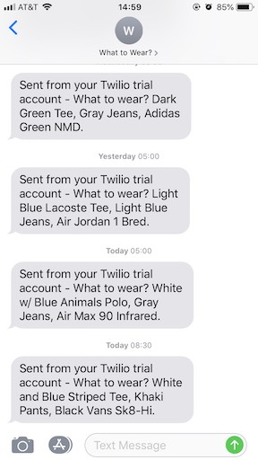

# What to Wear?
Can't decide what to wear? Or maybe you forgot what you wore the other day and don't want to rewear the same thing? What to Wear? is a service for picking out what to wear everyday. Discover new outfits and wear your clothes more evenly!  

The service will send you an SMS message everyday (or configurable by day of the week).  
<br/>


## Data Model
Data is modeled as documents. The document types described below are displayed as JSON. However, the JSON field types can be translated to an appropriate type for a given document store.

### users
Users of the service.
```json
{
    "created_at": 1567891563,
    "days": [true, true, true, true, true, false, false],
    "enabled": true,
    "first": "Andrew",
    "last": "Nguonly",
    "phone": "+18881234567",
    "enamil": "hello@world.com"
}
```

### tops
Shirts, sweaters, or whatever you wear on the top.
```json
{
    "color": "black",
    "created_at": 1567891563,
    "description": "Black Koto Chest Pocket Tee",
    "enabled": true,
    "sleeve": "short",
    "type": "tee",
    "user": "pgpa6ht0xrUaGyvnVycI"
}
```

### bottoms
Pants, shorts, or whatever you wear on the bottom.
```json
{
    "color": "gray",
    "created_at": 1567891563,
    "description": "Gray Shorts",
    "enabled": true,
    "length": "short",
    "user": "pgpa6ht0xrUaGyvnVycI"
}
```

### shoes
Sneakers, boots, or whatever you wear on the feet.
```json
{
    "brand": "vans",
    "color": "black",
    "created_at": 1567891563,
    "description": "Black Vans Sk8-Hi",
    "enabled": true,
    "type": "sneaker",
    "user": "pgpa6ht0xrUaGyvnVycI"
}
```

### outfits
A selection of top, bottom, and shoe.
```json
{
    "bottom": "IostngqsEWa8BThQYsoS",
    "shoe": "GJnQerscgmAhUp8SSB9h",
    "top": "8ilNYmsTHNEYtJbHAwRa",
    "ts": 1567891563,
    "user": "pgpa6ht0xrUaGyvnVycI"
}
```

## Deployment

### Environment Variables
`TWILIO_ACCOUNT_SID`: Twilio account SID.  
`TWILIO_AUTH_TOKEN`: Twilio auth token.  
`TWILIO_FROM_NUMBER`: Twilio number to send SMS from.  

### Google Cloud Firestore
Google Cloud Firestore is the document store used to back the service.

### Google Cloud Functions
Google Cloud Functions is the runtime which executes the entry point function `what_to_wear()` in `main.py`.

### Google Cloud Scheduler
Google Cloud Scheduler is configured to trigger the Cloud Function everyday at 5am PT: `0 5 * * *`.

### Twilio
Twilio is used to send SMS messages.
